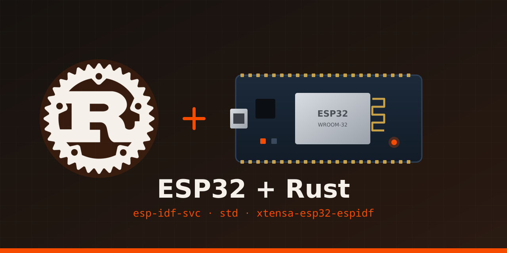

<div align="center">
  
</div>

# Exemplos de Firmware para ESP32 usando Rust

Coleção de exemplos de firmware em Rust para ESP32 (Xtensa), usando o
framework oficial **ESP-IDF** da Espressif através do ecossistema
[esp-rs](https://github.com/esp-rs). Cada exemplo é um binário separado
dentro do mesmo crate:

| Binário         | O que faz                                                      |
|-----------------|----------------------------------------------------------------|
| `blinkled`      | Pisca um LED no GPIO2 a cada 1 s                               |
| `adc`           | Lê o ADC1 (GPIO34) e imprime valor e tensão                    |
| `breathing_led` | Efeito "respiração" (fade in/out) com PWM (LEDC) no GPIO2      |
| `rxtx`          | Imprime o tempo de execução na serial a cada 1 s               |
| `rxtx_input`    | Lê linhas digitadas no monitor serial (stdin) e faz eco        |
| `lcd1602`       | Escreve texto e um contador num LCD1602 via I2C (PCF8574)      |

## Pré-requisitos de sistema

O build do ESP-IDF compila componentes em C, então são necessários alguns
pacotes de sistema além do Rust. No Fedora:

```bash
sudo dnf install -y clang clang-devel llvm-devel dfu-util ccache
```

- `clang`/`clang-devel`/`llvm-devel`: usados pelo `bindgen` para gerar os
  bindings Rust a partir dos headers C do ESP-IDF.
- `dfu-util`: gravação via DFU (alternativa ao serial, opcional).
- `ccache`: acelera recompilações do ESP-IDF (opcional, mas recomendado).

`python3`, `git`, `cmake`, `ninja`, `pkg-config`, `libudev` e `openssl`
também são necessários, mas já vêm em muitas instalações Fedora padrão.

## Instalando o toolchain Rust para Xtensa

O ESP32 "clássico" usa uma CPU Xtensa LX6, que não é suportada pelo
compilador Rust oficial — é necessário um fork mantido pela Espressif.
A ferramenta `espup` automatiza essa instalação.

```bash
cargo install espup --locked
espup install
```

Isso instala:
- O toolchain Rust para Xtensa (`rustup toolchain` chamado `esp`).
- O LLVM modificado que esse toolchain usa.
- O GCC (`xtensa-esp-elf`) necessário para linkar o binário final.

Ao final, o `espup` gera um script `~/export-esp.sh` com variáveis de
ambiente (`LIBCLANG_PATH`, `PATH`) que precisam ser carregadas **em todo
terminal novo** antes de compilar:

```bash
source ~/export-esp.sh
```

(Opcional: adicione essa linha ao seu `.bashrc`/`.zshrc` para não esquecer.)

Depois, instale as duas outras ferramentas do ecossistema:

```bash
cargo install ldproxy espflash --locked
```

- `ldproxy`: repassa a chamada de linkagem do `cargo` para o GCC do
  ESP-IDF (necessário porque o linker padrão do Rust não sabe gerar o
  binário final para o ESP-IDF).
- `espflash`: grava o binário compilado na flash do ESP32 via USB serial
  e abre o monitor serial.

## Estrutura do projeto e o que cada arquivo faz

```
blinkled/
├── Cargo.toml            # dependências, metadados e lista de binários
├── Cargo.lock            # versões exatas das dependências
├── build.rs              # dispara a configuração do ESP-IDF antes do build
├── rust-toolchain.toml   # fixa o toolchain "esp" para este projeto
├── sdkconfig.defaults    # configurações do ESP-IDF (SDK em C)
├── .cargo/config.toml    # target, linker e variáveis de ambiente do cargo
├── .gitignore            # ignora target/, .embuild/ e sdkconfig
├── src/
│   ├── blinkled.rs       # pisca LED (GPIO2)
│   ├── adc.rs            # leitura analógica (ADC1, GPIO34)
│   ├── breathing_led.rs  # PWM com fade in/out (LEDC)
│   ├── rxtx.rs           # saída serial periódica (println!)
│   └── rxtx_input.rs     # entrada serial via stdin
└── examples/
    └── breathing_led.md  # comparação C++/Arduino x Rust do PWM, explicada
```

Diretórios/arquivos gerados (não editar à mão): `target/` (saída do
cargo), `.embuild/` (ESP-IDF e ferramentas baixadas pelo `embuild`),
`sdkconfig` (gerado a partir do `sdkconfig.defaults`) e os `*.bin` /
`*.efuse` (imagens exportadas do `espflash`, se existirem na raiz).

### `Cargo.toml`

```toml
[package]
name = "esp32-examples"
version = "0.1.0"
authors = ["jgardona"]
edition = "2021"
resolver = "2"
rust-version = "1.77"

[[bin]]
name = "blinkled"
harness = false
path = "src/blinkled.rs"

[[bin]]
name = "adc"
path = "src/adc.rs"

[[bin]]
name = "breathing_led"
path = "src/breathing_led.rs"

[[bin]]
name = "rxtx"
path = "src/rxtx.rs"

[[bin]]
name = "rxtx_input"
path = "src/rxtx_input.rs"

[profile.release]
opt-level = "s"

[profile.dev]
debug = true
opt-level = "z"

[features]
default = []

[dependencies]
log = { version = "0.4", default-features = false }
esp-idf-svc = { version = "0.51" }

[build-dependencies]
embuild = "0.33"
```

- Vários `[[bin]]`: cada arquivo em `src/` é um programa independente,
  escolhido na hora de compilar/gravar com `--bin <nome>`.
- `[profile.dev]` com `opt-level = "z"` e `[profile.release]` com `"s"`:
  otimizam por tamanho, importante para caber na flash. `debug = true`
  mantém símbolos de debug, que não ocupam espaço na flash.
- `esp-idf-svc`: crate "guarda-chuva" do ecossistema esp-rs. Reexporta
  `esp_idf_svc::hal` (GPIO, delay, timers etc, vindo do crate
  `esp-idf-hal`) e `esp_idf_svc::sys` (bindings brutos gerados a partir do
  ESP-IDF em C, vindo do crate `esp-idf-sys`). Usamos as *features*
  padrão (`std` + `binstart`), que habilitam alocação dinâmica e o modo
  `std` do Rust — **não desabilite `default-features`**, senão módulos
  como `esp_idf_svc::log` somem (foi o erro `cannot find log in
  esp_idf_svc` que apareceu durante o setup).
- `embuild` (build-dependency): baixa o ESP-IDF automaticamente na
  primeira compilação e integra o build C ao `cargo build`.
- `harness = false`: desativa o test harness padrão do Cargo, que não
  faz sentido em firmware bare-metal/embarcado (declarado no `blinkled`
  para o rust-analyzer não reclamar).

### `build.rs`

```rust
fn main() {
    embuild::espidf::sysenv::output();
}
```

Executado antes da compilação do Rust: configura as variáveis de
ambiente (paths de headers, libs etc.) que o `esp-idf-sys` precisa para
gerar os bindings e linkar contra o ESP-IDF.

### `.cargo/config.toml`

```toml
[build]
target = "xtensa-esp32-espidf"

[target.xtensa-esp32-espidf]
linker = "ldproxy"
runner = "espflash flash --monitor"

[env]
MCU = "esp32"
ESP_IDF_VERSION = "v5.3.3"

[unstable]
build-std = ["std", "panic_abort"]
```

- `target`: alvo de compilação — CPU Xtensa do ESP32 rodando sobre ESP-IDF.
- `linker = "ldproxy"`: usa o linker especial em vez do padrão do sistema.
- `runner`: assim `cargo run` já grava o binário na placa e abre o
  monitor serial automaticamente.
- `ESP_IDF_VERSION`: versão do SDK C que o `embuild` baixa e compila.
- `build-std`: a standard library do Rust precisa ser recompilada para
  este alvo (não existe um build pré-compilado da std para
  `xtensa-esp32-espidf`).

### `rust-toolchain.toml`

```toml
[toolchain]
channel = "esp"
```

Fixa o toolchain `esp` (instalado pelo `espup`) para este projeto, para
não depender de trocar manualmente com `rustup override`.

### `sdkconfig.defaults`

Configurações do ESP-IDF em si (não do Rust):

```
CONFIG_ESPTOOLPY_FLASHSIZE_4MB=y
CONFIG_ESP_MAIN_TASK_STACK_SIZE=32768
CONFIG_COMPILER_CXX_EXCEPTIONS=y
CONFIG_ESP_CONSOLE_UART_BAUDRATE=115200
```

Define o tamanho da flash (4MB), aumenta a stack da task principal (o
runtime `std` do Rust consome mais stack que código C puro), habilita
exceções C++ (exigidas por alguns componentes internos do ESP-IDF) e fixa
o baud rate do console serial em 115200 (o mesmo usado pelo monitor do
`espflash`).

## Os exemplos

### `src/blinkled.rs`

```rust
use esp_idf_svc::hal::delay::FreeRtos;
use esp_idf_svc::hal::gpio::PinDriver;
use esp_idf_svc::hal::peripherals::Peripherals;
use log::info;
use esp_idf_svc::sys::EspError;

type Result<T> = std::result::Result<T, EspError>;

fn main() -> Result<()> {
    esp_idf_svc::sys::link_patches();
    esp_idf_svc::log::EspLogger::initialize_default();

    let peripherals = Peripherals::take()?;
    let mut led = PinDriver::output(peripherals.pins.gpio2)?;

    loop {
        led.set_high()?;
        info!("LED ligado");
        FreeRtos::delay_ms(1000);
        led.set_low()?;
        info!("LED desligado");
        FreeRtos::delay_ms(1000);
    }
}
```

- `type Result<T> = std::result::Result<T, EspError>;`: alias local para
  não precisar escrever `Result<T, EspError>` toda vez. **Importante**:
  o lado direito precisa do caminho completo `std::result::Result`,
  senão o compilador entende que `Result<T, EspError>` se refere ao
  próprio alias sendo definido, gerando erro de ciclo
  (`cycle detected when expanding type alias 'Result'`).
- `link_patches()`: obrigatório — resolve símbolos que o ESP-IDF precisa
  em runtime (ex: parte da implementação de `printf`).
- `EspLogger::initialize_default()`: conecta as macros `log::info!` etc.
  ao sistema de log do ESP-IDF, que aparece no monitor serial.
- `Peripherals::take()`: toma posse única dos periféricos do chip
  (padrão *singleton* do Rust embarcado — impede que duas partes do
  código configurem o mesmo pino ao mesmo tempo).
- `PinDriver::output(gpio2)`: configura o GPIO2 como saída digital.
  **GPIO2 é o LED onboard mais comum em placas DevKitC/NodeMCU-32S**,
  mas varia por fabricante — ajuste se necessário.
- O `?` em vez de `.unwrap()` propaga o `EspError` para fora do `main`,
  que o runtime do ESP-IDF trata (loga o erro e reinicia o chip via
  panic handler) em vez de um `panic!` genérico.

### `src/adc.rs`

Lê continuamente o conversor analógico-digital (ADC1) no **GPIO34** e
imprime o valor lido e a tensão correspondente a cada 200 ms.

- `AdcDriver::new(peripherals.adc1)`: driver do ADC1. O GPIO34 é um pino
  analógico válido (e só de entrada) no ESP32 clássico.
- `AdcChannelConfig { attenuation: DB_11, calibration: Calibration::Line, .. }`:
  atenuação de 11 dB (faixa de entrada maior, até ~3,1 V) e calibração
  por linha, que corrige a não-linearidade do ADC. Com calibração, a
  leitura já vem em **milivolts**, por isso `adc_val / 1000.0` dá volts.
- `AdcChannelDriver::new(&adc, gpio34, &config)`: liga o pino ao ADC.

### `src/breathing_led.rs`

Efeito de "respiração" no LED: o brilho sobe e desce suavemente usando
PWM pelo periférico **LEDC**.

- `LedcTimerDriver` (timer0, 1 kHz) define a base de tempo do PWM;
  `LedcDriver` (canal0, GPIO2) associa esse timer ao pino.
- `get_max_duty()` devolve o duty máximo da resolução configurada
  (255 em 8 bits); o loop sobe de 0 até o máximo e desce de volta, com
  `FreeRtos::delay_ms(10)` entre os passos.

Há uma explicação detalhada, linha por linha, comparando com o código
C++/Arduino equivalente em [`examples/breathing_led.md`](examples/breathing_led.md).

### `src/rxtx.rs`

Exemplo de **saída** pela serial: imprime com `println!` o tempo desde o
início (`std::time::Instant`) a cada segundo. Não usa o `EspLogger`,
apenas a saída padrão, que o ESP-IDF encaminha para a UART do console.

### `src/rxtx_input.rs`

Exemplo de **entrada** pela serial: lê linhas digitadas no monitor
(`stdin`) e devolve o texto com `print!`.

- A UART0 (TX=GPIO1, RX=GPIO3) já é usada pelo console do ESP-IDF
  (logs e monitor), então o código lê via `stdin` em vez de instalar um
  `UartDriver` próprio na mesma UART — os dois disputariam a porta e
  corromperiam entrada e saída.
- O `stdin` é não-bloqueante: sem uma linha completa disponível,
  `read_line` retorna `WouldBlock`, tratado no `match`. O loop espera
  10 ms entre as tentativas para não monopolizar a CPU.
- Pressione `<Enter>` no monitor para enviar a linha ao ESP32.

## Compilando

Em todo terminal novo, primeiro carregue as variáveis de ambiente do
toolchain Xtensa:

```bash
source ~/export-esp.sh
```

Depois, na raiz do projeto:

```bash
cargo build                      # compila todos os binários
cargo build --bin adc            # compila apenas um exemplo
cargo build --release            # build otimizado (opt-level "s")
```

Na primeira vez isso baixa e compila o ESP-IDF inteiro (pode levar
alguns minutos); as próximas compilações são incrementais e rápidas.
Cada binário final fica em
`target/xtensa-esp32-espidf/debug/<nome>` (ou `release/<nome>`), por
exemplo `target/xtensa-esp32-espidf/debug/blinkled`.

## Gravando na placa

Conecte o ESP32 via USB e rode o exemplo desejado. Como o projeto tem
vários binários, é preciso indicar qual com `--bin`:

```bash
cargo run --bin blinkled
cargo run --bin adc
cargo run --bin breathing_led
cargo run --bin rxtx
cargo run --bin rxtx_input
cargo run --bin lcd1602
```

Isso compila (se necessário), grava via `espflash` e abre o monitor
serial. `Ctrl+C` para sair do monitor, `Ctrl+R` para resetar o chip sem
sair.

Se a porta serial não for detectada automaticamente ou der erro de
permissão, veja a seção de troubleshooting abaixo.

## Gerando `.bin` para o simulador (PICSimLab)

O [PICSimLab](https://github.com/lcgamboa/picsimlab) simula o ESP32 com
QEMU e **não aceita o ELF** gerado pelo `cargo build`: ele precisa de uma
imagem completa da flash, em formato `.bin`. O `espflash` faz essa
conversão:

```bash
cargo build --release --bin lcd1602
espflash save-image --chip esp32 --merge --flash-size 4mb \
    target/xtensa-esp32-espidf/release/lcd1602 lcd1602.bin
```

Troque `lcd1602` pelo nome do exemplo desejado. As duas opções são
obrigatórias para o PICSimLab:

- `--merge`: junta bootloader, tabela de partições e aplicação num único
  arquivo, gravado a partir do endereço `0x0`. Sem ela, o `espflash`
  gera só a imagem da aplicação, que não dá boot sozinha no simulador.
- `--flash-size 4mb`: preenche (padding) o arquivo até o tamanho da
  flash. O QEMU só aceita imagens de exatamente 2, 4, 8 ou 16 MB. O
  arquivo final deve ter **4.194.304 bytes**.

Layout do `.bin` gerado:

| Offset    | Conteúdo             |
|-----------|----------------------|
| `0x1000`  | bootloader           |
| `0x8000`  | tabela de partições  |
| `0x10000` | aplicação (firmware) |

Depois, carregue o `.bin` na placa **ESP32-DevKitC** do PICSimLab pelo
menu **File**. **Recarregue o arquivo sempre que recompilar**: o
PICSimLab não percebe sozinho que o `.bin` mudou e continua rodando a
versão antiga.

O mesmo `.bin` também serve para gravar numa placa real, no endereço
`0x0`:

```bash
espflash write-bin 0x0 lcd1602.bin
```

## Troubleshooting

**Erro de permissão na porta serial** (`/dev/ttyUSB0` ou similar):
adicione seu usuário ao grupo `dialout` e faça logout/login:
```bash
sudo usermod -aG dialout $USER
```

**O monitor serial fica "parado" depois do boot**: normal se o seu
código não tiver `log::info!` dentro do loop — o firmware continua
rodando, só não imprime nada. Foi por isso que adicionamos os
`info!("LED ligado"/"LED desligado")` no loop: eles confirmam
visualmente, pelo monitor serial, que o loop está de fato executando.

**Sem logs no monitor em `breathing_led` e `rxtx`**: `breathing_led` não
usa a serial e `rxtx` usa só `println!`; somente `blinkled`, `adc` e
`rxtx_input` inicializam o `EspLogger` para o `log::info!` funcionar.

**O LED onboard não pisca, mas o log mostra "LED ligado"/"LED
desligado" alternando**: o firmware está correto, o problema é o pino.
Nem toda placa tem LED onboard no GPIO2 (alguns clones não têm LED
onboard nenhum, outros usam outro pino, ou o LED é ativo em nível
baixo). Teste com um LED externo:

```
GPIO2 ──[resistor 220-330Ω]──▶|── GND
                             LED
                (perna longa/ânodo do lado do resistor)
```

Nunca ligue um LED direto no GPIO sem resistor em série — risco de
queimar o LED ou danificar o pino.

**No PICSimLab, o LCD (ou outro periférico) mostra lixo ou comportamento
antigo**: antes de mexer no código, recarregue o `.bin` no PICSimLab. O
simulador continua rodando a imagem carregada anteriormente até que ela
seja recarregada. Confira também se o `.bin` foi gerado com `--merge` e
`--flash-size 4mb` (veja
[Gerando `.bin` para o simulador](#gerando-bin-para-o-simulador-picsimlab)).

**`cannot find 'log' in 'esp_idf_svc'`**: verifique se a dependência
`esp-idf-svc` no `Cargo.toml` **não** está com `default-features =
false` — as features padrão (`std`, que puxa `alloc`) precisam estar
habilitadas para o módulo `esp_idf_svc::log` existir.

## Rust vs. C++ no ESP32 — vale a pena?

Sim, é uma escolha viável e cada vez mais usada, especialmente com
suporte oficial da Espressif via [esp-rs](https://github.com/esp-rs).
Principais trade-offs:

- **A favor**: segurança de memória em tempo de compilação (sem
  null pointers, data races, buffer overflows), tratamento de erro
  explícito (`Result`/`Option`), Cargo é muito melhor que
  CMake/Makefiles manuais.
- **Contra**: ecossistema menor que C/Arduino (menos exemplos, menos
  bibliotecas de sensores prontas), toolchain mais pesada para chips
  Xtensa (fork do LLVM), curva de aprendizado do borrow checker somada
  à de embarcados.

Para prototipagem, aprendizado e produtos de porte pequeno/médio, é uma
escolha sólida. Bibliotecas C sem binding Rust ainda podem ser chamadas
via FFI através do `esp-idf-sys`.
